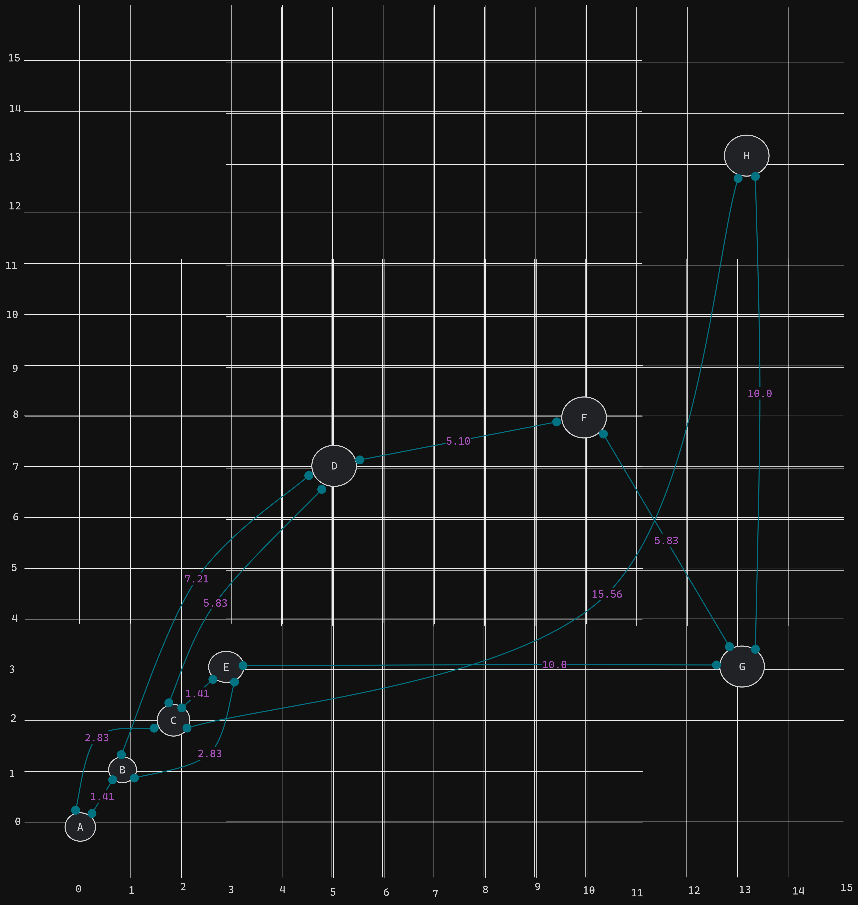

# La ruta mas corta con Algoritmo A\*

## Descripcion:
El algoritmo A\* es un algoritmo de busqueda informada, que se basa en la busqueda de un camino entre un nodo inicial y un nodo final, el cual se basa en la busqueda de un camino optimo, es decir, el camino que tenga el menor costo entre el nodo inicial y el nodo final.

## Funcionamiento:
Las estructuras de datos que se utilizan para el funcionamiento del algoritmo son las siguientes:

```
// City representa una ciudad con nombre, coordenadas x e y.
type City struct {
	Name       string
	X, Y       float64
	connection []string
}

// Distance representa la distancia entre dos ciudades.
type Distance struct {
	To       string
	Distance float64
}

// Graph representa el grafo de ciudades y distancias.
type Graph struct {
	Cities      []City
	Connections map[string][]Distance
}

// NewGraph crea un nuevo grafo a partir de un arreglo de ciudades.
func NewGraph(cities []City) Graph {
	connections := make(map[string][]Distance)

	for _, city := range cities {
		for _, cityName := range city.connection {
			cityFind := findCity(cities, cityName)
			if cityFind != nil {
				connections[cityName] = append(connections[cityName], Distance{
					To:       city.Name,
					Distance: calculateDistance(city, *cityFind),
				})
			}
		}
	}

	return Graph{
		Cities:      cities,
		Connections: connections,
	}
}

```
Estas son las funcioes que determian el funcionamiento del algoritmo:
```
// calculateDistance calcula la distancia entre dos ciudades.
func calculateDistance(city1, city2 City) float64 {
	return math.Sqrt(math.Pow(city1.X-city2.X, 2) + math.Pow(city1.Y-city2.Y, 2))
}

// Astar encuentra la ruta más cercana desde el inicio hasta el destino en el grafo.
func Astar(graph Graph, start, end string) ([]string, error) {
	// Verificamos si las ciudades de inicio y destino existen en el grafo.
	startCity, endCity := findCity(graph.Cities, start), findCity(graph.Cities, end)
	if startCity == nil || endCity == nil {
		return nil, fmt.Errorf("Ciudad de inicio o destino no encontrada")
	}

	openSet := make(map[string]bool)
	openSet[start] = true
	closedSet := make(map[string]bool)

	g := make(map[string]float64)
	for _, city := range graph.Cities {
		g[city.Name] = math.Inf(1)
	}
	g[start] = 0

	parent := make(map[string]string)

	for len(openSet) > 0 {

		current := findLowestF(openSet, g, end, &graph)

		if current == end {
			fmt.Println(openSet, closedSet, g, parent)
			return buildPath(parent, end), nil
		}

		delete(openSet, current)
		closedSet[current] = true

		for _, neighbor := range graph.Connections[current] {

			if closedSet[neighbor.To] {
				continue
			}

			tentativeG := g[current] + neighbor.Distance

			if !openSet[neighbor.To] || tentativeG < g[neighbor.To] {
				parent[neighbor.To] = current
				g[neighbor.To] = tentativeG
				openSet[neighbor.To] = true
			}
		}
	}

	return nil, errors.New("No se encontró un camino válido")
}

// findLowestF encuentra la ciudad con el valor F más bajo en el conjunto abierto.
func findLowestF(openSet map[string]bool, g map[string]float64, end string, graph *Graph) string {
	lowestF := math.Inf(1)
	var lowestCity string

	for city := range openSet {
		f := g[city] + heuristic(city, end, graph)
		if f < lowestF {
			lowestF = f
			lowestCity = city
		}
	}

	return lowestCity
}

// findCity encuentra una ciudad en un arreglo de ciudades.
func findCity(cities []City, name string) *City {
	for _, city := range cities {
		if city.Name == name {
			return &city
		}
	}
	return nil
}

// buildPath construye la ruta desde el inicio hasta el destino.
func buildPath(parent map[string]string, current string) []string {
	var path []string
	for current != "" {
		path = append([]string{current}, path...)
		current = parent[current]
		fmt.Println(current)
	}
	return path
}

// heuristic calcula la distancia entre dos ciudades.
func heuristic(city, end string, graph *Graph) float64 {
	startCity := findCity(graph.Cities, city)
	endCity := findCity(graph.Cities, end)
	if startCity != nil && endCity != nil {
		return math.Sqrt(math.Pow(startCity.X-endCity.X, 2) + math.Pow(startCity.Y-endCity.Y, 2))
	}
	return math.Inf(1)
}
```

## Tabla de descripcion de conexiones:
Se genera una tabla con las conexiones de las ciudades, con sus respectivas distancias.

| CITY | X     | Y     | CONNECTION(distances)                   |
| ---- | ----- | ----- | --------------------------------------- |
| A    | 0.00  | 0.00  | B (1.41), C (2.83)                      |
| B    | 1.00  | 1.00  | A (1.41), D (7.21), E (2.83)            |
| C    | 2.00  | 2.00  | A (2.83), D (5.83), E (1.41), H (15.56) |
| D    | 5.00  | 7.00  | B (7.21), C (5.83), F (5.10)            |
| E    | 3.00  | 3.00  | B (2.83), C (1.41), G (10.00)           |
| F    | 10.00 | 8.00  | D (5.10), G (5.83)                      |
| G    | 13.00 | 3.00  | E (10.00), F (5.83), H (10.00)          |
| H    | 13.00 | 13.00 | C (15.56), G (10.00)                    |

## Mapa de conexiones:
Mapa de conexiones de las ciudades.



## Ejecucion:
Para ejecutar el programa se debe ingresar el comando:
```go run main.go```


